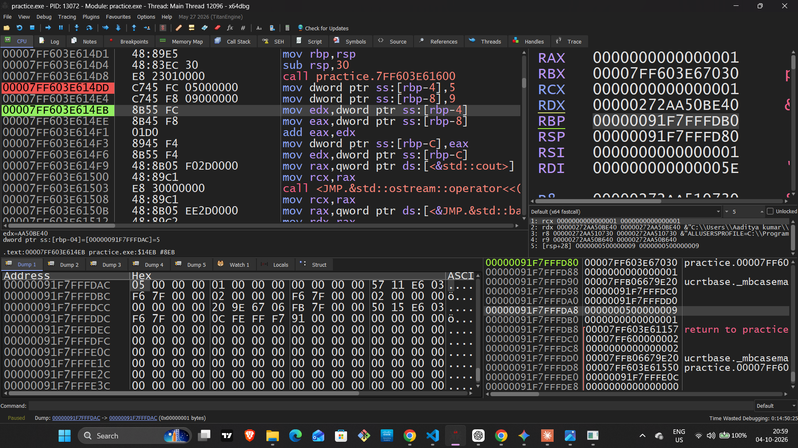
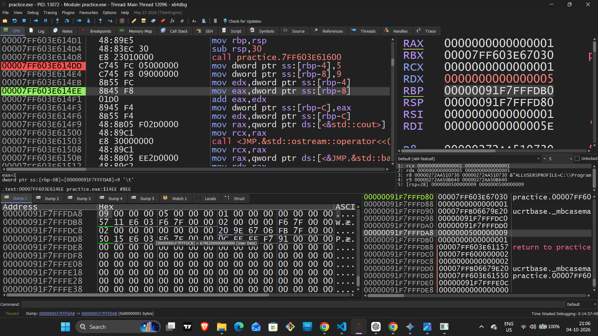
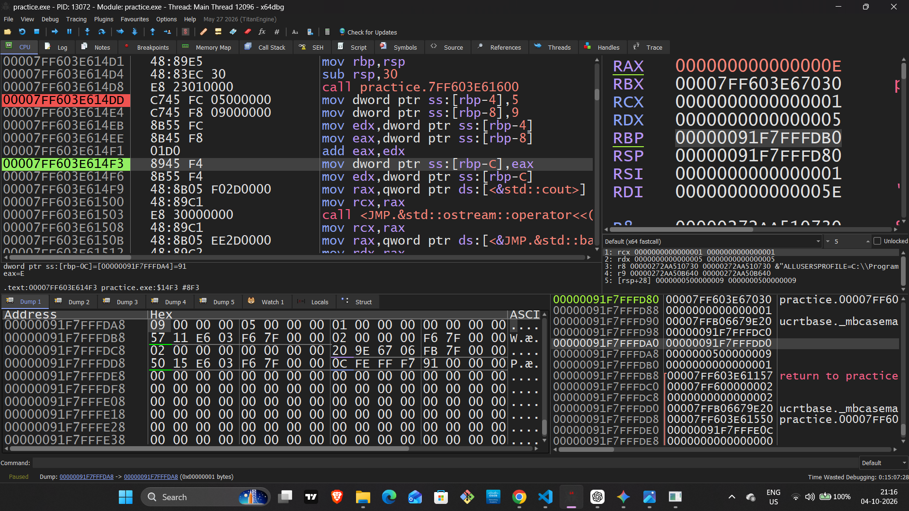
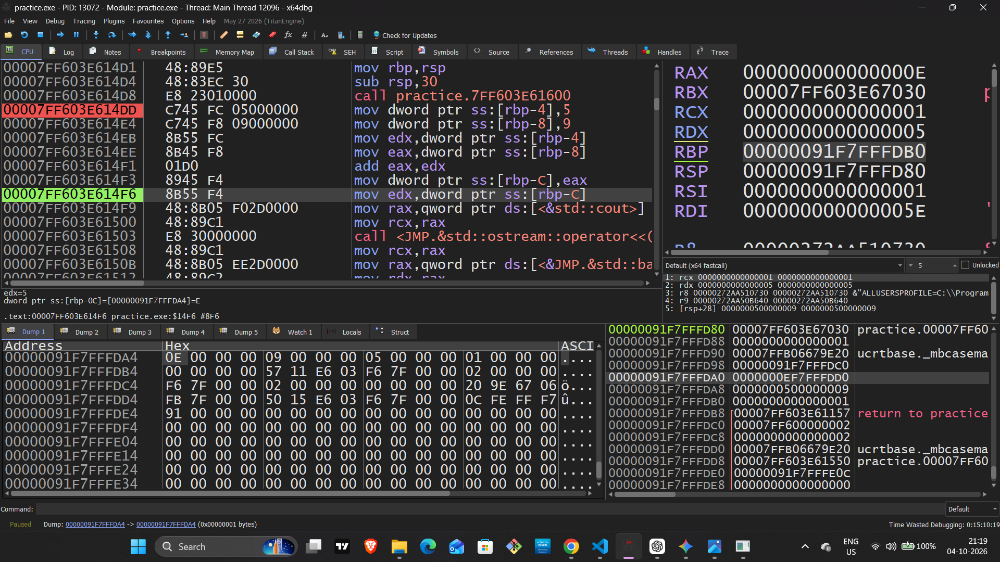

# Reverse Engineering Lab Report — Day 1

## Lab Overview

This lab analyzes a simple C++ integer-addition program using x64dbg.

The objective is to understand the complete data flow:

C++ Variables → Stack Memory → CPU Registers → ALU Operation → Result → Stack Memory

---

# Lab 01 — Stack Memory Allocation

## Objective

Observe how the local C++ variables `a = 5` and `b = 9` are stored in stack memory.

## Base Pointer

```text
RBP = 00000091F7FFFDB0
```

## Executed Instructions

```asm
mov dword ptr ss:[rbp-4], 5
mov dword ptr ss:[rbp-8], 9
```

## Instruction Analysis

```text
mov [rbp-4], 5
→ Stores integer 5 at [RBP - 0x4]

mov [rbp-8], 9
→ Stores integer 9 at [RBP - 0x8]
```

## Memory Address Calculation

### Variable `a`

```text
RBP - 0x4

0x00000091F7FFFDB0 - 0x4
= 0x00000091F7FFFDAC
```

Therefore:

```text
a = 5
Address = 00000091F7FFFDAC
```

### Variable `b`

```text
RBP - 0x8

0x00000091F7FFFDB0 - 0x8
= 0x00000091F7FFFDA8
```

Therefore:

```text
b = 9
Address = 00000091F7FFFDA8
```

## Memory Dump

Starting address:

```text
00000091F7FFFDA8
```

Observed bytes:

```text
09 00 00 00 05 00 00 00
```

## Memory Interpretation

```text
09 00 00 00
→ b = 9
→ Address: 00000091F7FFFDA8

05 00 00 00
→ a = 5
→ Address: 00000091F7FFFDAC
```

The values are stored in little-endian byte order.

## Evidence — Variable `a = 5`



## Evidence — Variable `b = 9`



---

# Lab 02 — Register Loading and ALU Addition

## Objective

Observe how the values stored in stack memory are loaded into CPU registers and added by the CPU's arithmetic logic.

## Executed Instructions

```asm
mov edx, dword ptr ss:[rbp-4]
mov eax, dword ptr ss:[rbp-8]
add eax, edx
```

## Instruction Analysis

### 1. Load `a`

```asm
mov edx, dword ptr ss:[rbp-4]
```

The CPU reads the value stored at `[RBP-0x4]`.

```text
[RBP-0x4] = 5

EDX = 00000005
```

### 2. Load `b`

```asm
mov eax, dword ptr ss:[rbp-8]
```

The CPU reads the value stored at `[RBP-0x8]`.

```text
[RBP-0x8] = 9

EAX = 00000009
```

### 3. Addition

```asm
add eax, edx
```

The CPU performs:

```text
EAX + EDX

9 + 5
= 14
```

Hexadecimal representation:

```text
14 decimal = 0x0E
```

After the instruction:

```text
EAX = 0000000E
RAX = 000000000000000E
```

## Data Flow

```text
Stack
[RBP-0x4] = 5
       ↓
      EDX

Stack
[RBP-0x8] = 9
       ↓
      EAX

     EAX + EDX
         ↓
        14
         ↓
  EAX = 0x0000000E
```

## Evidence — Register Addition



---

# Lab 03 — Result Stored Back to Stack

## Objective

Observe how the calculated result is written from the CPU register back into stack memory.

## Executed Instruction

```asm
mov dword ptr ss:[rbp-0xC], eax
```

The value currently stored in `EAX` is:

```text
EAX = 0000000E
```

Therefore, the instruction stores:

```text
14 decimal
```

at:

```text
[RBP-0xC]
```

## Memory Address Calculation

```text
RBP - 0xC

0x00000091F7FFFDB0 - 0xC
= 0x00000091F7FFFD A4
```

Therefore:

```text
c = 14
Address = 00000091F7FFFD A4
```

> Note: Remove the space in the address above when writing it in the final report:
> `00000091F7FFFDA4`

## Final Memory Dump

Starting address:

```text
00000091F7FFFDA4
```

Observed bytes:

```text
0E 00 00 00 09 00 00 00 05 00 00 00
```

## Memory Interpretation

```text
0E 00 00 00
→ c = 14
→ [RBP-0xC]
→ Address: 00000091F7FFFDA4

09 00 00 00
→ b = 9
→ [RBP-0x8]
→ Address: 00000091F7FFFDA8

05 00 00 00
→ a = 5
→ [RBP-0x4]
→ Address: 00000091F7FFFDAC
```

## Final Stack Layout

```text
Higher Address
┌──────────────────────────────┐
│ a = 5                        │ ← RBP-0x4
│ Address: 00000091F7FFFDAC    │
├──────────────────────────────┤
│ b = 9                        │ ← RBP-0x8
│ Address: 00000091F7FFFDA8    │
├──────────────────────────────┤
│ c = 14                       │ ← RBP-0xC
│ Address: 00000091F7FFFDA4    │
└──────────────────────────────┘
Lower Address
```

## Evidence — Final Memory Dump



---

# Final Analysis

The complete execution flow was observed in x64dbg:

```text
C++ Source
    ↓
Local Variables
    ↓
Stack Memory
    ↓
RBP-relative addressing
    ↓
CPU Registers
    ↓
ALU Addition
    ↓
EAX = 14
    ↓
Result stored back to Stack
```

## Key Concepts Learned

- Local variables can be stored in stack memory.
- `RBP` can be used as a reference point for stack locations.
- `[RBP-0x4]`, `[RBP-0x8]`, and `[RBP-0xC]` refer to different memory locations.
- `MOV` transfers data between memory and registers.
- `ADD` performs integer addition.
- `EAX` is the lower 32-bit portion of `RAX`.
- Integer `14` is represented as `0x0E` in hexadecimal.
- x64dbg can be used to observe registers, memory, and instruction execution.
- Memory bytes are displayed in little-endian order on x86-64 systems.

## Conclusion

This lab demonstrated the complete movement of data from C++ variables to stack memory, from stack memory to CPU registers, through an arithmetic operation, and finally back to stack memory.

The experiment was verified using x64dbg register and memory observations.