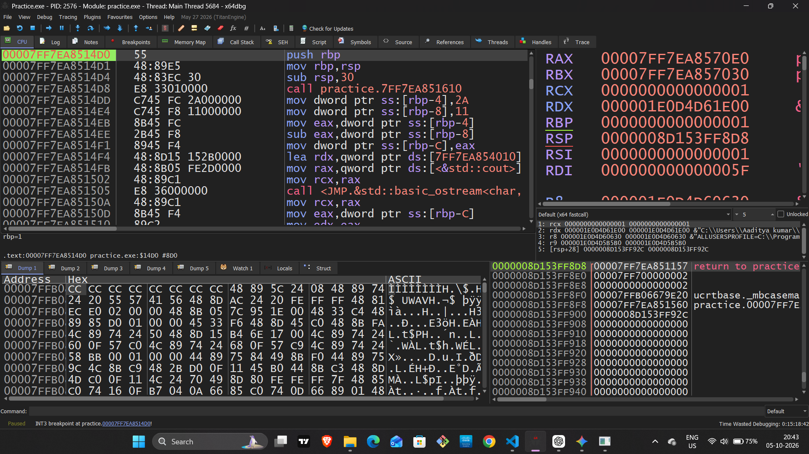
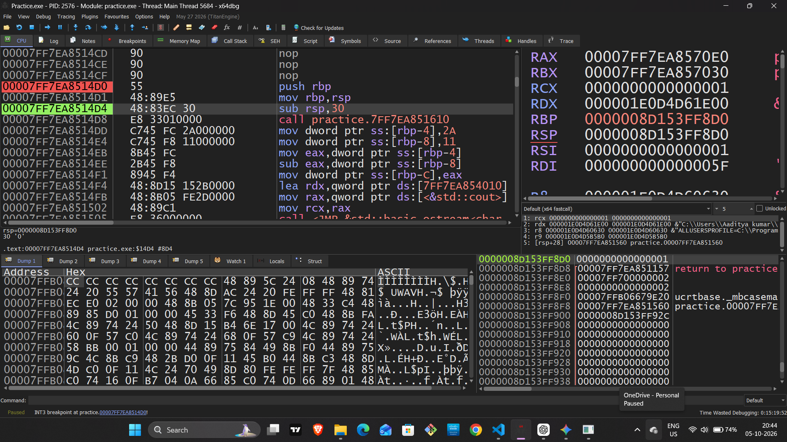
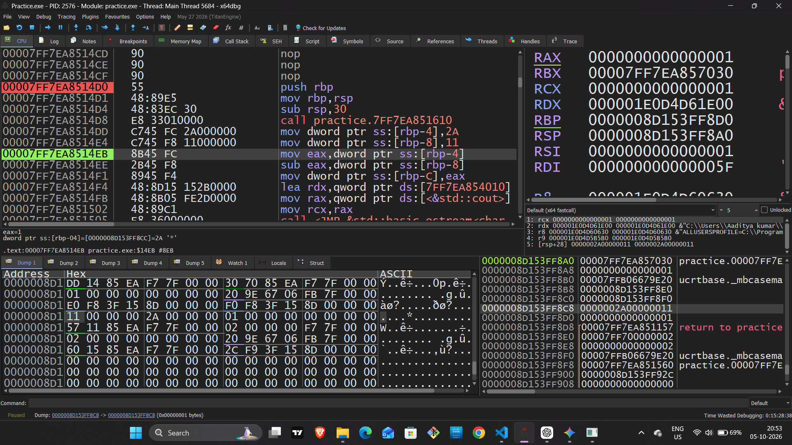
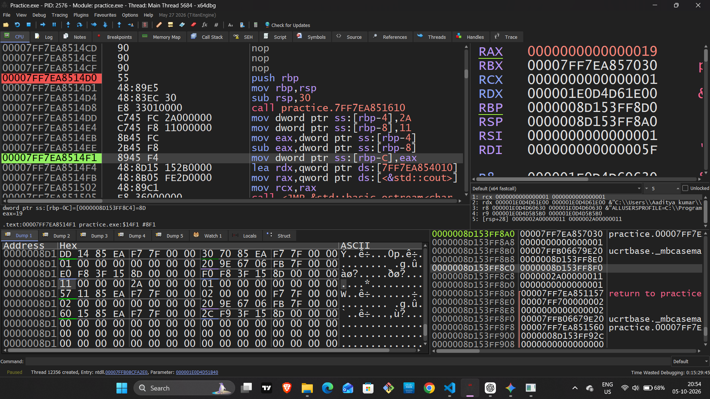
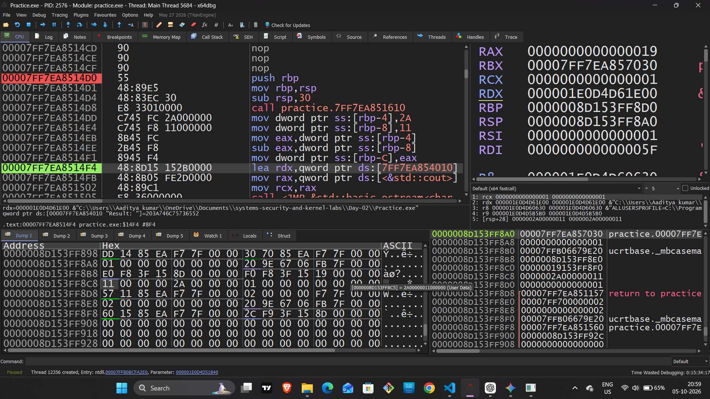

# Day 2 — Reverse Engineering Practice: Debugging `a - b`

## 1. Practice Setup

Today I debugged a simple C++ program in **x64dbg** to understand how the
`a - b` calculation works at the assembly, register, and memory levels.

### C++ Source Code

```cpp
#include <iostream>

int main() {
    int a = 42;
    int b = 17;
    int result = a - b;

    std::cout << "Result: " << result << std::endl;

    return 0;
}
```



### Program Values

| Variable | Decimal | Hexadecimal |
|---|---:|---:|
| `a` | 42 | `0x2A` |
| `b` | 17 | `0x11` |
| `result` | 25 | `0x19` |

```text
42 - 17 = 25
0x2A - 0x11 = 0x19
```

---

# 2. Stack Frame Setup

The function starts by setting up a stack frame:

```asm
push rbp
mov rbp, rsp
sub rsp, 0x30
```

### What these instructions do

```text
push rbp
→ Saves the previous RBP value on the stack.

mov rbp, rsp
→ Copies the current RSP value into RBP.
→ RBP becomes our reference point.

sub rsp, 0x30
→ Reserves 48 bytes of stack space.
```



---

# 3. Storing Variables in Memory

The local variables are stored in stack memory using offsets from `RBP`.

### `a = 42`

```asm
mov dword ptr [rbp-4], 2A
```

This means:

```text
[RBP-4] → 0x2A → 42
```

### `b = 17`

```asm
mov dword ptr [rbp-8], 11
```

This means:

```text
[RBP-8] → 0x11 → 17
```

So the memory layout is:

```text
[RBP-4] = 42
[RBP-8] = 17
```

The same stack-memory view also helps verify the stored values before the
calculation.

---

# 4. Loading `a` into EAX

The CPU first loads `a` from memory into the `EAX` register:

```asm
mov eax, dword ptr [rbp-4]
```

The data flow is:

```text
[RBP-4]
   │
   │ 42
   ▼
 EAX
```

Therefore:

```text
EAX = 0x2A
```


---

# 5. Performing the Subtraction

Now the actual subtraction happens:

```asm
sub eax, dword ptr [rbp-8]
```

The CPU performs:

```text
42 - 17 = 25
```

or in hexadecimal:

```text
0x2A - 0x11 = 0x19
```

### Before Execution

```text
EAX = 0x2A
```

### After Execution

```text
EAX = 0x19
EAX = 25
```



> Use one screenshot here that clearly shows the `SUB` instruction and the
> register change. There is no need for separate before/after screenshots.

---

# 6. Storing the Result in Memory

The result is then written back to stack memory:

```asm
mov dword ptr [rbp-0xC], eax
```

This means:

```text
EAX = 25
   │
   ▼
[RBP-0xC] = 25
```

Therefore:

```text
[RBP-0xC] = 0x19
```

The memory dump can also be used to verify the final stored value.



---

# 7. Memory Dump — Little-Endian Verification

The memory dump was inspected in x64dbg to verify how the values are actually
stored in memory.

### `a = 42`

```text
0x2A
```

Stored as:

```text
2A 00 00 00
```

### `b = 17`

```text
0x11
```

Stored as:

```text
11 00 00 00
```

### `result = 25`

```text
0x19
```

Stored as:

```text
19 00 00 00
```

Because the system uses **Little-Endian byte ordering**, the least significant
byte appears first in memory.

The memory dump screenshot above verifies the values and their byte
representation.

---

# 8. Address Calculation

During debugging, the `RBP` value was:

```text
RBP = 0000008D153FF8D0
```

The addresses were calculated using the offsets:

```text
RBP - 4  = 0000008D153FF8CC
RBP - 8  = 0000008D153FF8C8
RBP - C  = 0000008D153FF8C4
```

Therefore:

```text
[RBP-4]   → a
[RBP-8]   → b
[RBP-0xC] → result
```



---

# 9. x64dbg Verification

### Step Over — `F8`

I used `F8` to execute the instructions one by one and observe the changes.

### Memory Navigation — `Ctrl + G`

I used `Ctrl + G` to navigate to the calculated memory addresses and inspect
their contents.

### Register Verification

Before subtraction:

```text
EAX = 0x2A
```

After subtraction:

```text
EAX = 0x19
```

### Final Memory Verification

The final result was stored as:

```text
19 00 00 00
```

which represents:

```text
25
```


---

# 10. Complete Execution Flow

```text
a = 42
     ↓
[RBP-4]
     ↓
EAX = 42
     ↓
SUB 17
     ↓
EAX = 25
     ↓
[RBP-0xC]
     ↓
result = 25
```


---

# Day 2 Summary

Today I debugged a simple C++ `a - b` operation in **x64dbg** and traced the
complete flow from **stack memory → register → subtraction → memory**.

### Concepts Practiced

- `RBP`-relative addressing
- `EAX` register values
- Hexadecimal representation
- Stack memory offsets
- Little-Endian representation
- Address calculation
- Memory Dump inspection
- Instruction-by-instruction debugging with `F8`
- Memory navigation with `Ctrl + G`

### Final Result

```text
42 - 17 = 25
0x2A - 0x11 = 0x19
```

The complete execution can be summarized as:

```text
Memory → Register → SUB → Register → Memory
```
```

