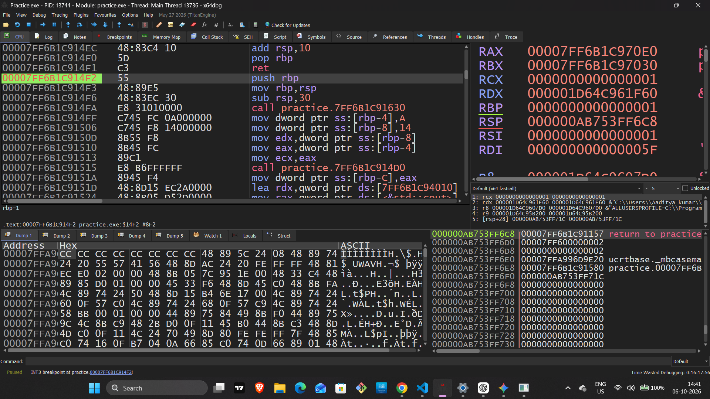
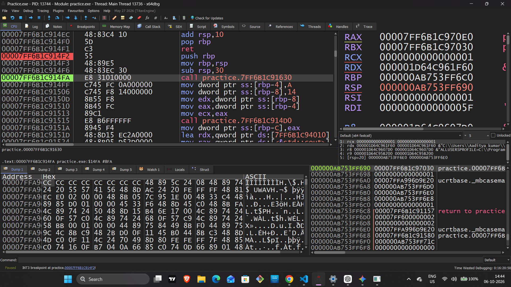
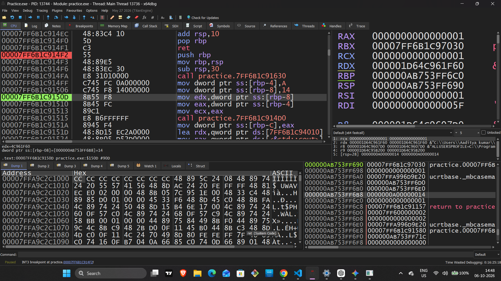
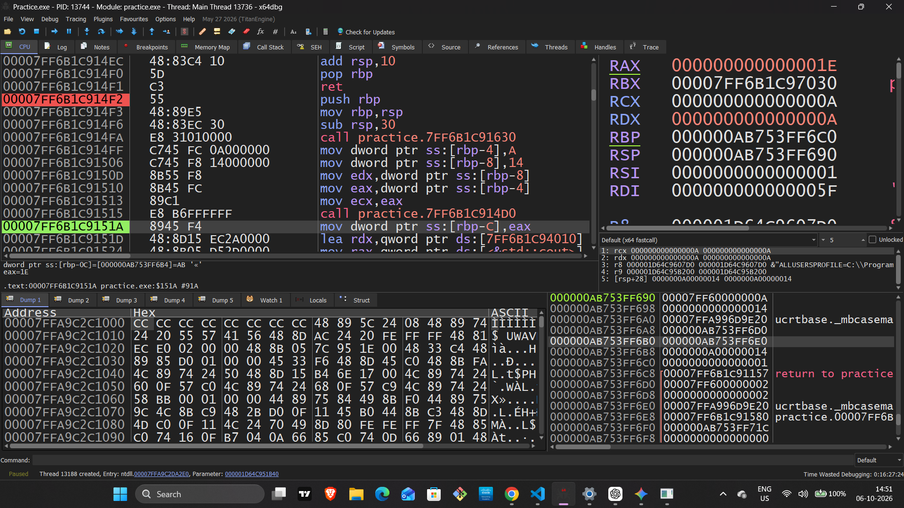
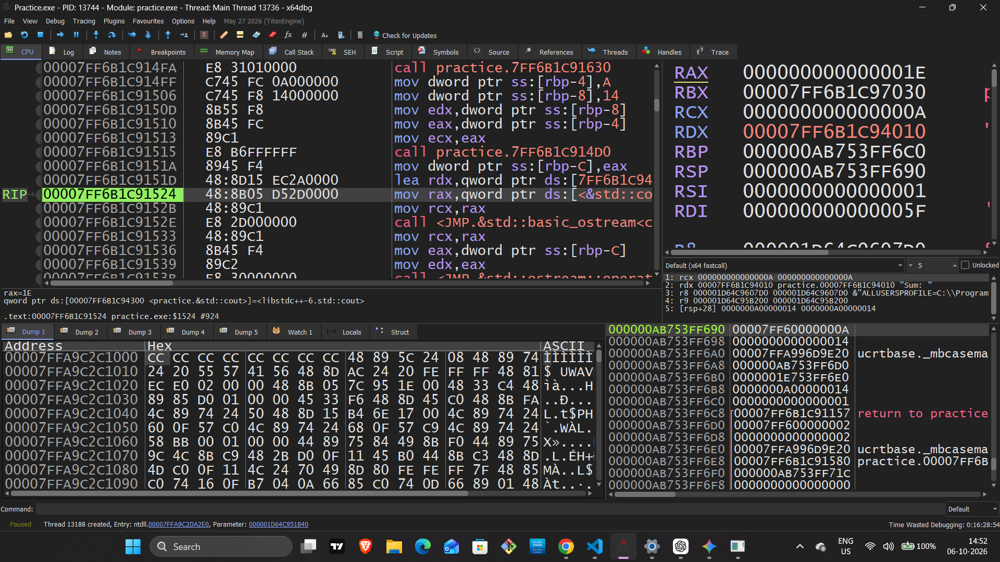

# Day 03: x64 Assembly & x64dbg Practical Workflow

## 🎯 Objective

The main objective of this practical session was to understand and observe the following concepts in x64 Architecture in real time using the `x64dbg` debugger:

- **Function Prologue**
- **Stack Memory Allocation**
- **`[RBP - offset]` Variable Storage**
- **`CALL` Execution**
- **`RIP` Tracking**

In this practical, assembly instructions were executed step-by-step to observe the changes occurring in registers, stack, and memory.

---

# 🛠️ Step-by-Step Practical Execution

## Step 1: Function Prologue Execution

### Instructions

```asm
push rbp
mov rbp, rsp
```

### Why?

Every function has its own stack frame.

The function prologue is used to preserve the previous `RBP` and then set `RBP` to the current `RSP` position, preparing the new stack frame.

### What Happened?

```asm
push rbp
```

The previous `RBP` address was saved onto the stack.

Then:

```asm
mov rbp, rsp
```

`RBP` was set to the current `RSP` location.

### Result

Both `RBP` and `RSP` started pointing to the same address:

```text
000000AB753FF6C0
```

### Screenshot



---

# Step 2: Stack Space Allocation

### Instruction

```asm
sub rsp, 30
```

### Why?

Stack memory space is required to store local variables and temporary data used by the function.

### What Happened?

```asm
sub rsp, 30
```

This instruction subtracted `0x30` from `RSP`.

```text
0x30 = 48 bytes
```

### Result

The new `RSP` value became:

```text
000000AB753FF690
```

This allocated stack memory space for local variables.

### Screenshot



---

# Step 3: Local Variable Storage

## `[RBP - offset]`

### Why?

To store the local variables of the C++ program:

```text
x = 10
y = 20
```

inside the stack frame.

### What Happened?

First:

```asm
mov dword ptr ss:[rbp-4], A
```

The value:

```text
10 = 0xA
```

was stored at the:

```text
[RBP-4]
```

offset.

For the second variable:

```asm
mov dword ptr ss:[rbp-8], 14
```

The value:

```text
20 = 0x14
```

was stored at the:

```text
[RBP-8]
```

offset.

### Result

The hexadecimal values of both variables were stored at their respective `[RBP - offset]` locations and could be observed in the stack window.

### Screenshot



---

# Step 4: Function `CALL` Instruction

### Instruction

```asm
CALL
```

### Why?

The `CALL` instruction is used to call another function while tracking the return address so execution can return to the main code after the function completes.

### What Happened?

Before the function call, arguments were passed through registers:

```text
RCX
RDX
```

Observed values:

```text
RAX = 0xA
RDX = 0x14
```

Then:

```asm
CALL
```

was executed.

When `CALL` was executed, the address of the next instruction was pushed onto the stack.

After the function executed, the result was:

```text
RAX = 0x1E
```

Its decimal value is:

```text
30
```

### Result

The function executed successfully, and the result:

```text
10 + 20 = 30
```

was obtained in the `RAX` register.

### Screenshot



---

# Step 5: RIP Tracking with F8

### Debugger Action

```text
F8 → Step Over
```

### Why?

`RIP` was tracked to understand which instruction the CPU was executing at each step.

### What Happened?

`F8 (Step Over)` was used in `x64dbg` to move through the execution instruction-by-instruction.

With each step, the value of `RIP` was updated.

### Result

`RIP` continuously pointed to the next execution location.

Example:

```text
00007FF6B1C91524
```

### Screenshot



---

# 🧠 Key Learnings

### 1. Memory Allocation

Stack space for local variables was allocated using:

```asm
sub rsp, XX
```

In this practical:

```text
0x30 = 48 bytes
```

---

### 2. Registers & Stack

```text
RBP → Base Reference of the Stack Frame
RSP → Current Stack Position
```

`RBP` was used to reference the stack frame, while `RSP` tracked the current stack position.

---

### 3. Control Flow

The `CALL` instruction transferred execution to another function and the return address was tracked on the stack.

`RIP` continuously tracked the current/next instruction location during execution.

---

# 🔄 Practical Flow

```text
Function Prologue
       ↓
push rbp
       ↓
mov rbp, rsp
       ↓
Stack Space Allocation
       ↓
sub rsp, 0x30
       ↓
Local Variable Storage
       ↓
[RBP-4] / [RBP-8]
       ↓
CALL Execution
       ↓
Return Address
       ↓
RIP Tracking
       ↓
F8 Step Over
```

---

# 📸 Screenshots

All practical screenshots used in this documentation:

```text
Screenshots/
├── 01_prologue_rbp_rsp.png
├── 02_sub_rsp_stack_allocation.png
├── 03_rbp_offset_variable.png
├── 04_call_instruction_stack.png
└── 05_rip_step_over_f8.png
```

---

## ✅ Day 03 Completed

**x64 Assembly & x64dbg Practical Workflow**

> Function Prologue → Stack Allocation → Variable Storage → CALL → RIP Tracking
```