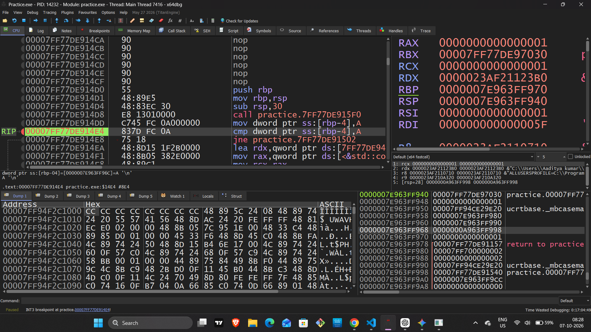
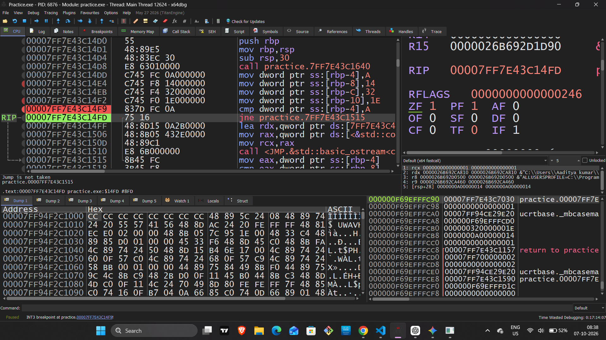
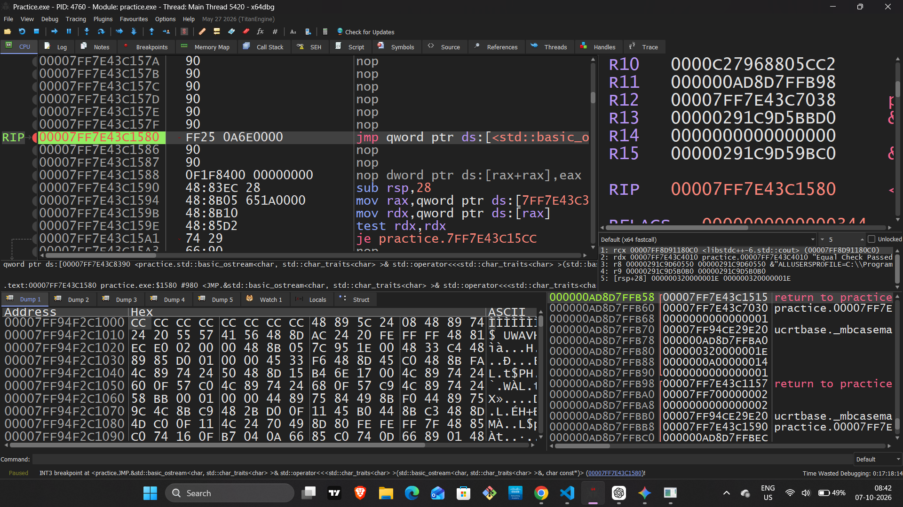

# 🎯 Day 04 Practical Analysis — Control Flow & CPU Flags in x64dbg

## 📌 Practical Overview

Today, I performed a practical x64dbg analysis to understand how a program makes decisions at the assembly level.

The main focus was:

- `CMP` — Compare
- `TEST` — Logical Test
- `RFLAGS` — CPU Flags
- `ZF` — Zero Flag
- `JNE` — Conditional Jump
- `JMP` — Unconditional Jump
- `RIP` — Instruction Pointer
- Control Flow Tracking

The goal was not only to read assembly instructions, but to observe how CPU flags and jump instructions work together to control program execution.

---

# 1. 🧠 Why Did I Perform This Practical?

In a high-level language such as C++, we can write a condition like:

```cpp
if (a == 10) {
    // execute this block
}
```

At the assembly level, the CPU does not directly understand the concept of an `if` statement.

Instead, the compiler can translate the condition into instructions such as:

```asm
CMP
JNE
JMP
```

The CPU uses the result of the comparison and the values of its flags to determine which execution path to follow.

### The basic idea

```text
High-Level Code
      ↓
     if
      ↓
Assembly Comparison
      ↓
     CMP
      ↓
   CPU Flags
      ↓
Conditional Jump
      ↓
Execution Path
```

This practical helped me observe that process directly inside x64dbg.

---

# 2. 🎯 Objective / Purpose

The main objectives of this practical were:

### 2.1 Understand `CMP`

To observe how the CPU compares two values.

`CMP` performs a subtraction internally:

```text
op1 - op2
```

The result is not stored in the destination operand.

Instead, the operation updates CPU flags in `RFLAGS`.

---

### 2.2 Understand `RFLAGS`

To observe how CPU flags change after a comparison.

The main flags relevant to this practical were:

```text
ZF — Zero Flag
SF — Sign Flag
CF — Carry Flag
OF — Overflow Flag
```

For this practical, `ZF` was especially important.

---

### 2.3 Understand Conditional Jumps

To understand how instructions such as:

```asm
JE
JNE
```

use CPU flags to decide whether execution should branch to another address.

---

### 2.4 Understand Unconditional Jump

To observe how:

```asm
JMP
```

changes the execution flow without checking a condition.

---

# 3. 🔬 Practical Control-Flow Example

The practical used a comparison similar to:

```asm
cmp dword ptr ss:[rbp-4], A
jne <target>
```

Here:

```text
[RBP-4] = 10
A       = 10
```

So conceptually:

```text
10 - 10 = 0
```

Because the comparison produces zero, the CPU sets:

```text
ZF = 1
```

The next instruction is:

```asm
JNE
```

But `JNE` means:

```text
Jump if Not Equal
```

`JNE` takes the jump when:

```text
ZF = 0
```

Since:

```text
ZF = 1
```

the jump is **not taken**.

---

# 4. 📸 Screenshot 1 — CMP Instruction

## Comparison Initialization

**Screenshot:** `01_cmp_instruction.png`

Place this screenshot directly below this section.



### What is happening?

At this point, x64dbg is showing the `CMP` instruction:

```asm
cmp dword ptr ss:[rbp-4], A
```

The value stored at:

```text
[RBP-4] = 0xA
```

and:

```text
0xA = 10
```

So the CPU is preparing to compare:

```text
10 with 10
```

Conceptually:

```text
10 - 10
   ↓
   0
```

### Important

At this exact point, if `CMP` has **not executed yet**, the flags have not yet been updated by this particular `CMP`.

This screenshot represents the state **before executing the comparison**.

---

# 5. ⚙️ What Happens When CMP Executes?

When the `CMP` instruction executes:

```asm
cmp dword ptr ss:[rbp-4], A
```

the CPU internally performs:

```text
10 - 10
   ↓
   0
```

The result is not stored.

Instead, CPU flags are updated.

The important flag here is:

```text
ZF = 1
```

because the comparison result is zero.

### Mental Model

```text
CMP
 ↓
10 - 10
 ↓
0
 ↓
ZF = 1
```

This flag state is then used by the following conditional jump.

---

# 6. 📸 Screenshot 2 — ZF & JNE

## Flag State & Conditional Branching

**Screenshot:** `02_jne_zf_jump_not_taken.png`

Place this screenshot directly below this section.



### What is happening?

After executing the `CMP`, x64dbg shows the next instruction:

```asm
JNE
```

The CPU flag state shows:

```text
ZF = 1
```

The two compared values were equal:

```text
10 == 10
```

Therefore:

```text
ZF = 1
```

But `JNE` means:

```text
Jump if Not Equal
```

`JNE` requires:

```text
ZF = 0
```

Since:

```text
ZF = 1
```

the condition for `JNE` is false.

Therefore:

```text
JNE → Jump Not Taken
```

This is why x64dbg indicates:

```text
Jump is not taken
```

### Control Flow

```text
CMP
 ↓
10 == 10
 ↓
ZF = 1
 ↓
JNE checks ZF
 ↓
ZF is not 0
 ↓
JNE NOT TAKEN
 ↓
Continue to next instruction
```

This is the most important observation from this screenshot.

---

# 7. 🧠 Understanding ZF — Zero Flag

The Zero Flag is one of the most important flags when analyzing equality comparisons.

If an operation produces zero:

```text
ZF = 1
```

If the result is not zero:

```text
ZF = 0
```

For example:

```text
5 - 5 = 0
```

Therefore:

```text
ZF = 1
```

But:

```text
5 - 3 = 2
```

Therefore:

```text
ZF = 0
```

This is why:

```asm
JE
```

and:

```asm
JNE
```

can be used to analyze equality.

```text
JE  → ZF = 1
JNE → ZF = 0
```

---

# 8. 📸 Screenshot 3 — JMP

## Unconditional Control Flow

**Screenshot:** `03_jmp_unconditional.png`

Place this screenshot directly below this section.



### What is happening?

The instruction shown is:

```asm
JMP <target>
```

Unlike a conditional jump, `JMP` does not check:

```text
ZF
SF
CF
OF
```

to decide whether to jump.

It simply transfers execution to its target.

### Control Flow

```text
Current Instruction
        ↓
       JMP
        ↓
Target Address
        ↓
Continue Execution
```

So:

```text
JMP → Always transfers control
```

---

# 9. 🔀 Conditional vs Unconditional Jump

It is important to understand the difference.

### Conditional Jump

Example:

```asm
JNE target
```

The CPU checks a condition.

```text
Condition?
   ↓
 ┌───┴───┐
YES     NO
 ↓       ↓
Jump    Continue
```

### Unconditional Jump

Example:

```asm
JMP target
```

No condition is required.

```text
JMP
 ↓
Target
```

---

# 10. 🔍 Practical Analysis Workflow in x64dbg

The workflow I used during this practical was:

### Step 1 — Locate the Comparison

Find the relevant:

```asm
CMP
```

or:

```asm
TEST
```

instruction.

---

### Step 2 — Check the Operands

Inspect the values being compared.

For example:

```text
[RBP-4] = 10
```

and:

```text
A = 10
```

---

### Step 3 — Predict the Result

Before executing the instruction, predict:

```text
10 - 10 = 0
```

Therefore:

```text
ZF should become 1
```

---

### Step 4 — Execute Using F8

Press:

```text
F8 — Step Over
```

Then observe the updated flag state.

---

### Step 5 — Analyze the Conditional Jump

Look at:

```asm
JNE
```

and check:

```text
ZF
```

Since:

```text
ZF = 1
```

the `JNE` condition is false.

---

### Step 6 — Verify the Execution Path

Observe the next instruction / `RIP` location.

If the jump is not taken:

```text
JNE
 ↓
Next Instruction
```

If the jump is taken:

```text
JNE
 ↓
Target Address
```

This allows the execution path to be verified directly inside x64dbg.

---

# 11. 🧠 Complete Practical Mental Model

The complete process can be understood as:

```text
Values in Registers / Memory
            ↓
        CMP / TEST
            ↓
      CPU Flags Updated
            ↓
       Conditional Jump
            ↓
      Condition Evaluated
            ↓
      Jump Taken / Not Taken
            ↓
            RIP
            ↓
     New Execution Path
```

For today's specific example:

```text
[RBP-4] = 10
      ↓
CMP 10, 10
      ↓
10 - 10 = 0
      ↓
ZF = 1
      ↓
JNE checks ZF
      ↓
ZF ≠ 0
      ↓
JNE NOT TAKEN
      ↓
Next Instruction
```

---

# 12. 🔑 Key Takeaways

### 1. CPU Decision Making

A high-level condition such as:

```cpp
if (a == 10)
```

can be represented at the assembly level using a comparison followed by control-flow instructions.

---

### 2. Flags Control Conditional Jumps

Instructions such as:

```asm
JE
JNE
JG
JL
JA
JB
```

use CPU flag states to determine whether a branch should be taken.

---

### 3. `CMP` Does Not Store the Result

`CMP` performs a subtraction internally:

```text
op1 - op2
```

but does not store that subtraction result in the destination.

Instead, it updates flags.

---

### 4. `JNE` Depends on ZF

```text
ZF = 0 → JNE can be taken
ZF = 1 → JNE is not taken
```

---

### 5. `JMP` Does Not Depend on a Condition

```asm
JMP target
```

directly transfers execution to its target.

---

### 6. x64dbg Makes the Control Flow Visible

By observing:

```text
Instruction
Registers
Flags
RIP
```

we can predict and verify how the program moves through different execution paths.

---

# 🛠️ Tools Used

- **x64dbg**
- **x64 Assembly**
- **C++ test program**

---

# 📂 Screenshot Structure

The screenshots for this practical are stored in:

```text
Day-04/
└── Screenshots/
    ├── 01_cmp_instruction.png
    ├── 02_jne_zf_jump_not_taken.png
    └── 03_jmp_unconditional.png
```

---

# ✅ Day 04 Practical Complete

## Core Concept

```text
CMP / TEST
     ↓
RFLAGS
     ↓
Conditional Jump
     ↓
Jump Taken / Not Taken
     ↓
RIP
     ↓
Execution Path
```

This practical helped me understand how a simple high-level decision becomes a sequence of low-level instructions, CPU flag changes, and control-flow decisions.

🔐 **One step deeper into x64 Assembly and Reverse Engineering.**
```