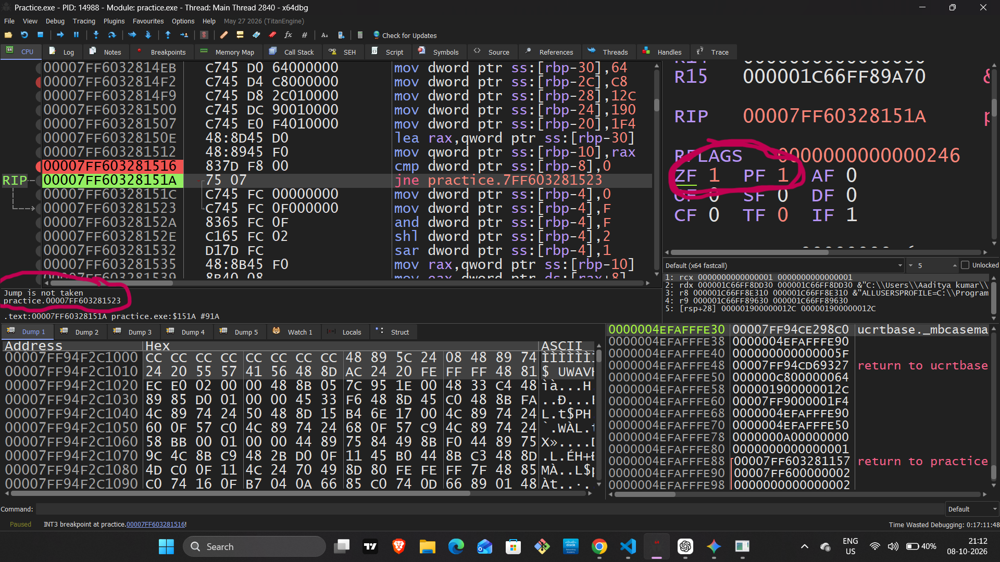
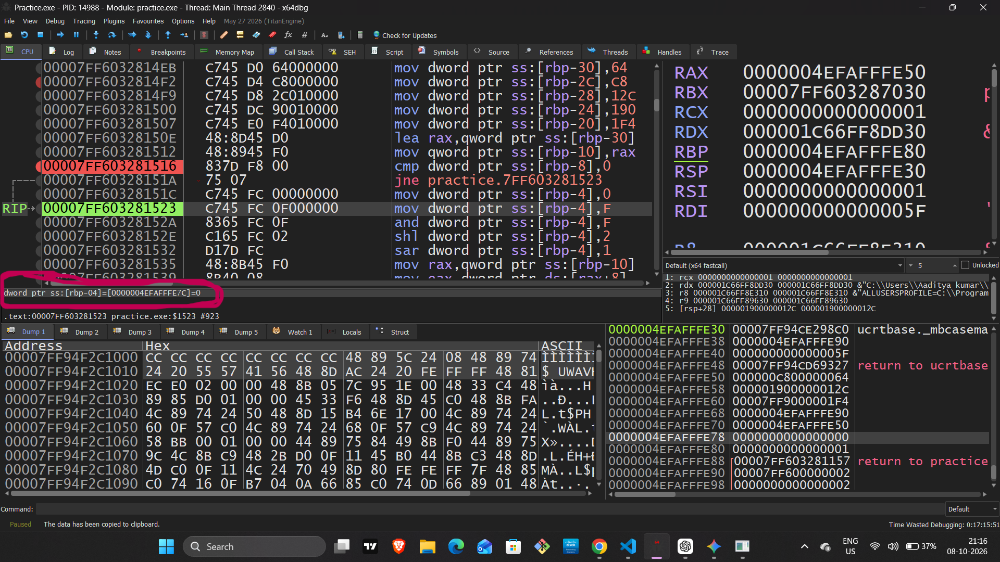
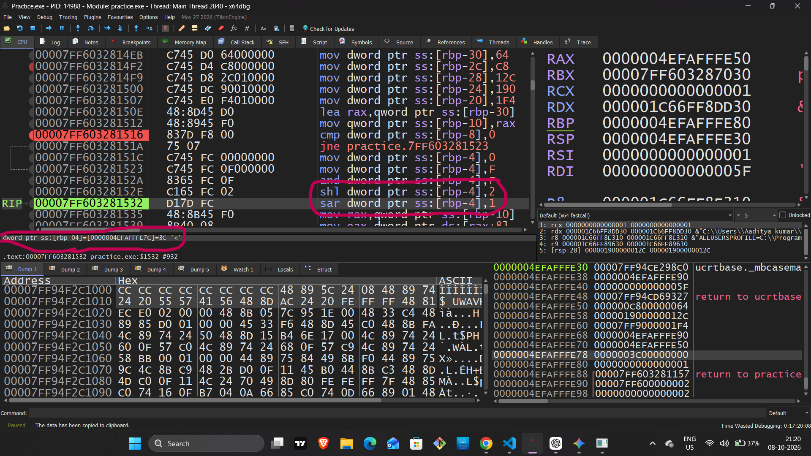
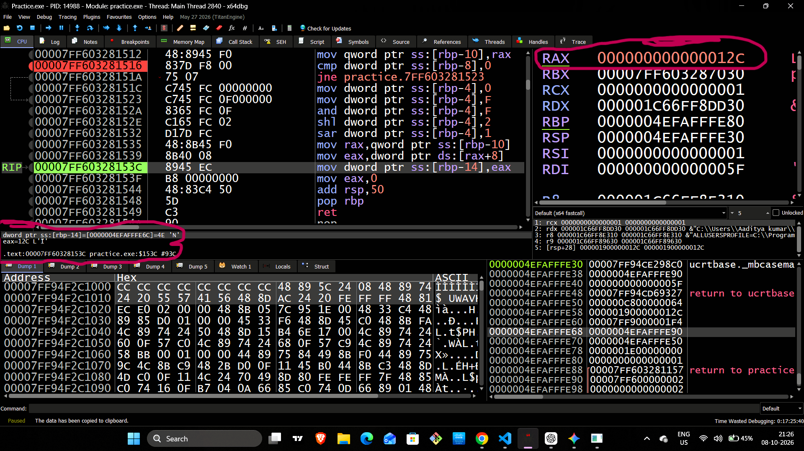
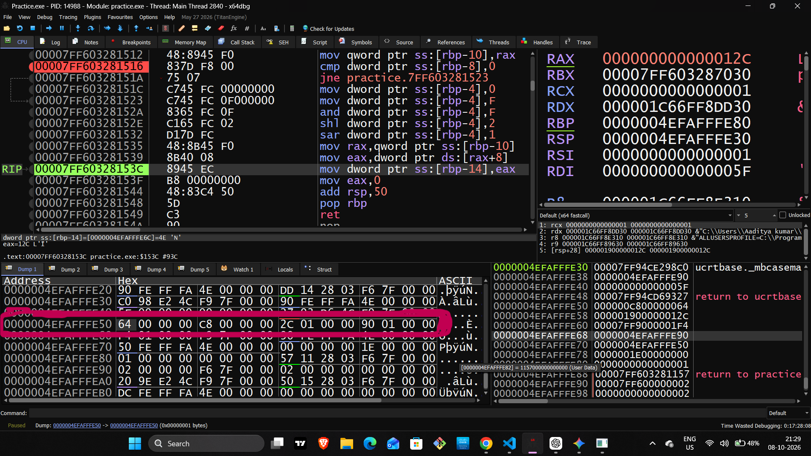

# Day 5 — Assembly (x64) & x64dbg Practical Reference Notes

## 1. C++ Source Code — `test.cpp`

```cpp
#include <iostream>

int main() {
    // 1. Bitwise & Flags Check
    int a = 10;
    int b = 0;

    // 2. Memory Array (Addressing Test)
    int arr[5] = {100, 200, 300, 400, 500};
    int* ptr = arr;

    // Zero Flag Logic
    if (b == 0) {
        a = a ^ a;   // Result becomes 0
    }

    // Bitwise & Shift Operations
    a = 15;          // 0x0F
    a = a & 0x0F;    // AND bitmask
    a = a << 2;      // 15 × 4 = 60
    a = a >> 1;      // 60 / 2 = 30

    // Memory Access
    int val = *(ptr + 2);   // arr[2] = 300

    return 0;
}
```

---

# 2. Practical Verification Checklist

## 📍 Step 1 — `CMP` / Zero Flag (ZF)

### Assembly Pattern

```asm
cmp dword ptr ss:[rbp-8], 0
```

### Logic

The instruction compares the value stored at:

```text
[RBP - 8]
```

with:

```text
0
```

If the value is `0`:

```text
ZF = 1
```

If the value is not `0`:

```text
ZF = 0
```

### Conditional Jump

For example:

```asm
cmp dword ptr ss:[rbp-8], 0
jne  somewhere
```

`JNE` means:

```text
Jump if ZF = 0
```

Therefore, when:

```text
b = 0
ZF = 1
```

the `JNE` condition is **false**, so the jump is **not taken**.

> **Important:** `CMP` performs a subtraction internally for flag-setting purposes, but does not store the subtraction result.

### x64dbg Verification

Check:

- CPU window → `CMP` instruction
- Registers panel → `ZF = 1`
- Conditional jump → `JNE` not taken

### Screenshot 1 — CMP, Zero Flag (ZF) & Conditional Jump



**Observed in x64dbg:**
- `CMP [RBP-8], 0`
- `ZF = 1`
- `JNE` was not taken

Highlight:

```text
CMP instruction
+
ZF = 1
```

---

# 3. Step 2 — Zeroing `a`

C++:

```cpp
a = a ^ a;
```

Logically:

```text
a XOR a = 0
```

Therefore:

```text
a = 0
```

A compiler may represent this in assembly in different ways depending on **optimization level, compiler, and surrounding code**.

One possible optimized result is:

```asm
mov dword ptr ss:[rbp-4], 0
```

This means:

```text
[RBP - 4] = 0
```

### Important Practical Note

Do **not** assume that every compiler must generate:

```asm
mov [rbp-4], 0
```

It could instead use a register-based zeroing pattern such as:

```asm
xor eax, eax
```

or optimize the entire operation away.

### x64dbg Verification

If your particular build shows:

```asm
mov dword ptr ss:[rbp-4], 0
```

then verify:

```text
[RBP - 04] = 0
```

### Screenshot 2 — Zeroing a



**Observed in x64dbg:**
- `mov dword ptr ss:[rbp-4], 0`
- `[RBP-04] = 0`

Highlight:

```text
mov dword ptr ss:[rbp-04], 0
```

and/or the corresponding memory value:

```text
[RBP-04] = 0
```

---

# 4. Step 3 — Bitwise AND & Shift Operations

## 4.1 AND Masking

C++:

```cpp
a = 15;
a = a & 0x0F;
```

Decimal:

```text
15 = 0x0F
```

Therefore:

```text
0x0F
AND
0x0F
----
0x0F
```

Result:

```text
15
```

A possible assembly representation is:

```asm
and dword ptr ss:[rbp-4], 0Fh
```

This preserves the **lower 4 bits**.

---

## 4.2 Left Shift — `SHL`

C++:

```cpp
a = a << 2;
```

Starting value:

```text
a = 15
```

Binary:

```text
0000 1111
```

Shift left by 2:

```text
0011 1100
```

Therefore:

```text
15 × 2²
= 15 × 4
= 60
```

Hexadecimal:

```text
60 = 0x3C
```

Possible assembly:

```asm
shl dword ptr ss:[rbp-4], 2
```

### Result

```text
[RBP-04] = 0x3C
```

or:

```text
[RBP-04] = 60
```

---

## 4.3 Right Shift — `SHR` / `SAR`

C++:

```cpp
a = a >> 1;
```

At this point:

```text
a = 60
```

Binary:

```text
0011 1100
```

Right shift by 1:

```text
0001 1110
```

Therefore:

```text
60 / 2 = 30
```

Hexadecimal:

```text
30 = 0x1E
```

### Important Correction

Your original note said:

```text
SAR/SHR
```

That should **not** be treated as if they are the same instruction.

- `SHR` → **logical right shift**
- `SAR` → **arithmetic right shift**

For the positive value `60`, both produce the same numerical result:

```text
60 >> 1 = 30
```

But they differ for values whose sign bit is set.

So in x64dbg, record the **actual instruction you see**:

```asm
shr ...
```

or:

```asm
sar ...
```

Do not label one as both.

### Screenshot 3 — Shift Operations



**Observed in x64dbg:**
- `SHL [RBP-04], 2`
- `SAR [RBP-04], 1`
- `[RBP-04] = 0x3C` (60 decimal)

Highlight the instruction and the resulting value:

```text
0x3C = 60
```

and, after the right shift:

```text
0x1E = 30
```

---

# 5. Step 4 — Memory Addressing & Pointer Logic

C++:

```cpp
int arr[5] = {100, 200, 300, 400, 500};
int* ptr = arr;

int val = *(ptr + 2);
```

Because:

```text
sizeof(int) = 4 bytes
```

the address calculation is:

```text
ptr + (2 × 4)
```

Therefore:

```text
ptr + 8 bytes
```

Conceptually:

```text
[BASE + INDEX × SCALE]
```

For this access:

```text
BASE  = ptr
INDEX = 2
SCALE = 4
```

Therefore:

```text
Address = BASE + (2 × 4)
        = BASE + 8
```

The target is:

```text
arr[2] = 300
```

---

## Possible Assembly Representation

You may see something similar to:

```asm
mov eax, dword ptr ds:[rax+8]
```

If, at that moment:

```text
RAX = address of arr[0]
```

then:

```text
[RAX + 8]
```

refers to:

```text
arr[2]
```

because:

```text
8 bytes ÷ 4 bytes per int = 2
```

### Result

```text
300 decimal = 0x12C
```

So after:

```asm
mov eax, dword ptr ds:[rax+8]
```

you may see:

```text
EAX = 0000012C
```

Since writing to a 32-bit register zero-extends into the corresponding 64-bit register on x86-64:

```text
RAX = 000000000000012C
```

### Screenshot 4 — Memory Access & Register Value



**Observed in x64dbg:**
- `mov eax, dword ptr ds:[rax+8]`
- `RAX = 0x12C`
- `EAX = 0x12C`
- `0x12C = 300 decimal`

Highlight:

```text
EAX = 0000012C
```

or, depending on what x64dbg displays:

```text
RAX = 000000000000012C
```

> **Important:** Do not assume RAX is always the array base. The compiler may use another register or memory location. Verify the register value in your actual x64dbg session.

---

# 6. Step 5 — Memory Dump & Little-Endian

The array is:

```text
arr[0] = 100
arr[1] = 200
arr[2] = 300
arr[3] = 400
arr[4] = 500
```

### Decimal → Hex

```text
100 = 0x64
200 = 0xC8
300 = 0x12C
400 = 0x190
500 = 0x1F4
```

Because each `int` occupies 4 bytes:

```text
arr[0] → 64 00 00 00
arr[1] → C8 00 00 00
arr[2] → 2C 01 00 00
arr[3] → 90 01 00 00
arr[4] → F4 01 00 00
```

---

## Little-Endian Representation

x86/x64 systems use **little-endian byte order**.

This means the **least significant byte is stored at the lowest memory address**.

For:

```text
300 decimal
```

we have:

```text
300 = 0x012C
```

Split into bytes:

```text
01 2C
```

Little-endian storage:

```text
2C 01
```

Because `int` occupies 4 bytes:

```text
2C 01 00 00
```

Therefore:

```text
Memory:

2C 01 00 00
│  │
│  └── High byte
└───── Low byte
```

### Screenshot 5 — Memory Dump & Little-Endian



**Observed in x64dbg:**
- `64 00 00 00` → 100
- `C8 00 00 00` → 200
- `2C 01 00 00` → 300
- `90 01 00 00` → 400
- Values are stored in Little-Endian byte order.

Highlight the array bytes:

```text
64 00 00 00
C8 00 00 00
2C 01 00 00
```

and annotate:

```text
64 00 00 00 → 100
C8 00 00 00 → 200
2C 01 00 00 → 300
```

---

# 7. x64dbg Screenshot Attachment Index

### Screenshot 1 — Flags

**Location:** CPU Window

Highlight:

```text
CMP [RBP-08], 0
```

and:

```text
ZF = 1
```

Also show that:

```text
JNE
```

is **not taken**.

---

### Screenshot 2 — Zeroing

Highlight:

```text
[RBP-04] = 0
```

If the compiler generated:

```asm
mov dword ptr [rbp-04], 0
```

highlight that instruction as well.

---

### Screenshot 3 — Shift Operations

Highlight:

```text
SHL → 0x3C → 60
```

and then:

```text
SHR/SAR → 0x1E → 30
```

Use the **actual instruction present in your binary**.

---

### Screenshot 4 — Register Value

Highlight:

```text
EAX = 0000012C
```

or:

```text
RAX = 000000000000012C
```

This represents:

```text
300 decimal
```

---

### Screenshot 5 — Memory Dump

Highlight:

```text
64 00 00 00
C8 00 00 00
2C 01 00 00
```

Annotate:

```text
100
200
300
```

and label:

```text
Little-Endian
```

---

# 8. Final Practical Mapping

```text
C++ Source
    ↓
Compiler
    ↓
x86-64 Assembly
    ↓
CPU Registers + Flags
    ↓
Memory
    ↓
x64dbg Observation
```

### The Core Connections

```text
b == 0
   ↓
CMP
   ↓
ZF = 1
   ↓
JE / JNE decision
```

```text
a = a ^ a
   ↓
a = 0
   ↓
Compiler chooses an appropriate instruction sequence
```

```text
a = a & 0x0F
   ↓
AND
   ↓
Lower 4 bits preserved
```

```text
15 << 2
   ↓
60
   ↓
0x3C
```

```text
60 >> 1
   ↓
30
   ↓
0x1E
```

```text
*(ptr + 2)
   ↓
ptr + (2 × sizeof(int))
   ↓
ptr + 8
   ↓
arr[2]
   ↓
300
   ↓
0x12C
```

```text
0x012C
   ↓
Little-Endian
   ↓
2C 01 00 00
```

> **Important practical rule:** The C++ source tells us the intended operation, but the **actual assembly, register allocation, stack offsets, and memory addresses must always be verified in your specific x64dbg build**. Compiler version, optimization level, and build settings can change the generated assembly.