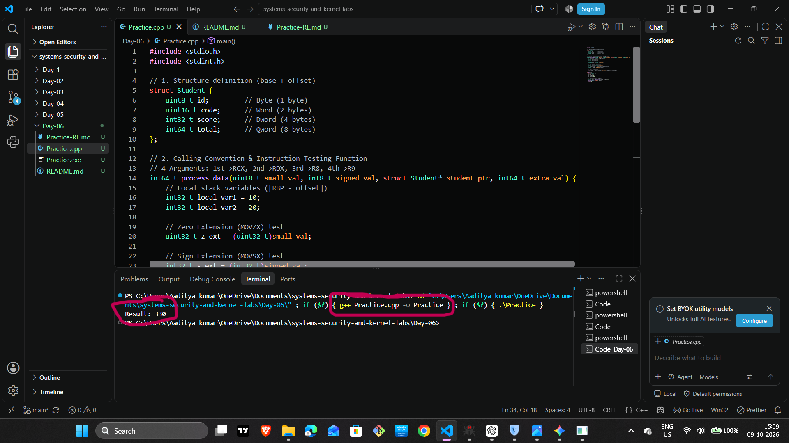
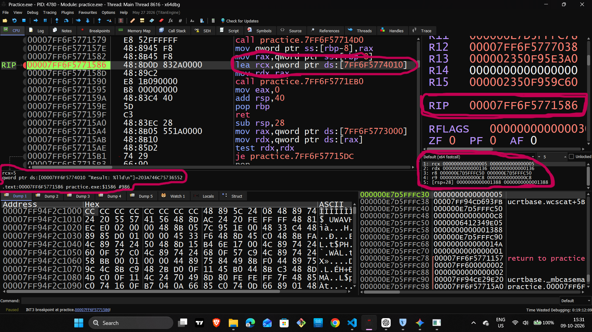
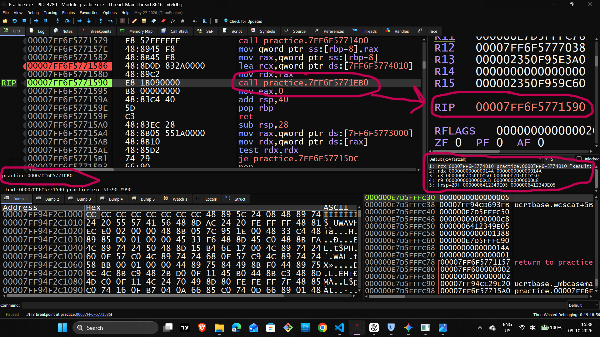
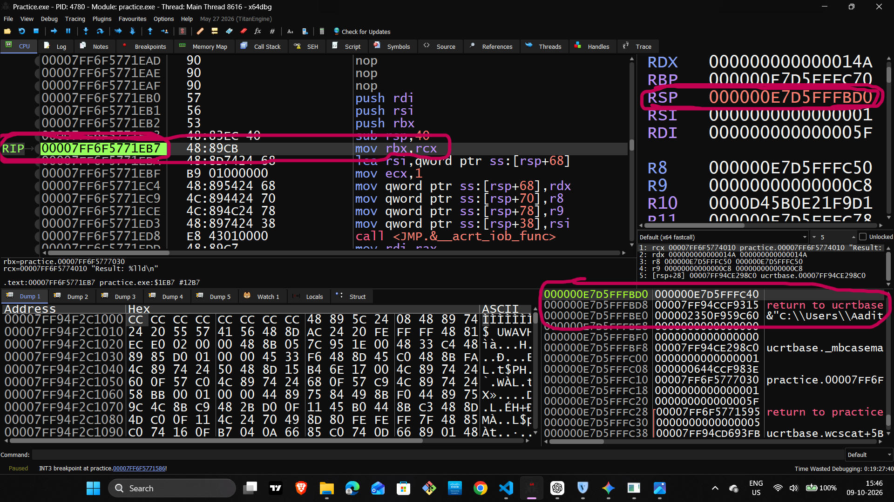
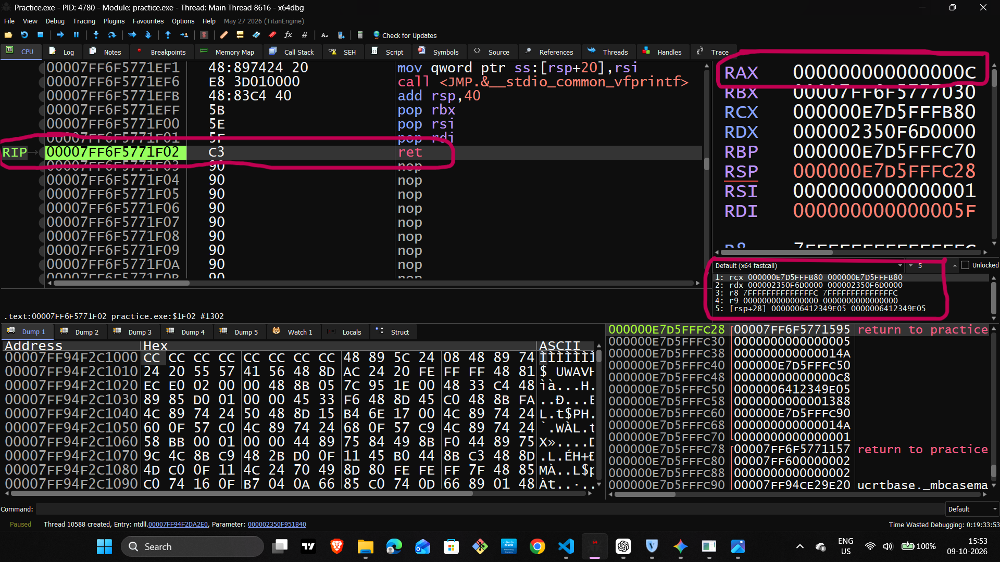

# Day 6 — x64 Assembly & Reverse Engineering Practical Lab Report

## Project Overview

**Topic:** x64 Assembly, Function Calls, Stack Frames, Registers, and Return Values

**Programming Language:** C++

**Compiler:** GCC (g++)

**Debugger:** x64dbg

**Operating System:** Windows x64

**Lab Type:** Practical Reverse Engineering and Runtime Analysis

---

# 1. Introduction

In this practical lab, I analyzed a compiled C++ program using x64dbg to understand how high-level code behaves at the assembly level.

The main goal was to observe how a program executes, how function calls work, how arguments are passed through registers, how stack frames are created, and how function return values are handled.

Instead of examining only the C++ source code, I inspected the compiled executable at runtime.

This practical helped me connect high-level programming concepts with low-level computer operations.

## Learning Objectives

By completing this lab, I aimed to understand:

1. How a C++ source file is compiled into an executable.
2. How to load a compiled program into x64dbg.
3. How to locate relevant code using string references and disassembly.
4. How the Windows x64 calling convention passes function arguments.
5. How a function prologue establishes a stack frame.
6. How RSP and RBP are used during function execution.
7. How integer return values are commonly delivered through RAX or EAX.
8. How CALL and RET instructions control program execution.
9. How to verify program behavior by inspecting registers, memory, and instructions.

---

# 2. Why Is This Practical Important?

## 2.1 Understanding How Programs Execute

When we write a program in C++, we usually work with variables, functions, loops, and expressions.

For example:

```cpp
long long calculate()
{
    return 330;
}
```

At the source-code level, this function simply returns a number.

However, the compiled program uses machine instructions, registers, memory, and control-flow operations to perform that task.

By examining assembly instructions in a debugger, we can investigate how the compiled program implements the original source code.

**Important:** A compiler does not necessarily translate every C++ statement into one assembly instruction. It may optimize, combine, or remove operations.

## 2.2 Understanding Memory and Registers

Registers are small storage locations inside the CPU that are used during instruction execution.

Examples include:

- RAX: Commonly used for integer return values and arithmetic.
- RCX: Commonly used for the first integer or pointer argument in the Windows x64 calling convention.
- RDX: Commonly used for the second integer or pointer argument.
- RSP: Tracks the current top of the stack.
- RBP: Often used as a reference point for a stack frame.

Inspecting these registers helps us understand how values move through a program.

## 2.3 Understanding Function Calls

Functions allow programs to divide work into reusable blocks.

At the assembly level, a function call involves control-flow instructions, a return address, register usage, and sometimes stack memory.

Understanding this behavior is useful for:

- Software debugging.
- Binary analysis.
- Compiler behavior analysis.
- Understanding executable files.
- Defensive security research.
- Reverse engineering unfamiliar programs.

---

# 3. Step 1 — Compilation and Binary Verification



## 3.1 Theory

Compilation is the process of transforming source code into a program that can be executed by the operating system.

In this lab, the C++ source file was compiled into an executable file named `Practice.exe`.

The general process is:

```text
C++ Source Code
       |
       v
Compiler (g++)
       |
       v
Compiled Executable
       |
       v
Program Execution
       |
       v
Console Output
```

The compiler translates the source code into machine instructions and produces an executable file along with any required program metadata.

## 3.2 Why Did We Perform This Step?

Before analyzing assembly instructions, we need a compiled program.

This step helps verify that:

- The source code can be compiled.
- The compiler produces an executable file.
- The executable can run.
- The program produces the expected output.

It also establishes the binary that will be examined in the debugger.

## 3.3 How Was It Performed?

The general workflow was:

1. Open the terminal in the project directory.
2. Compile the C++ source file using GCC.
3. Check whether compilation succeeds.
4. Run the generated executable.
5. Observe the program output.

An example compilation command is:

```bash
g++ Practice.cpp -o Practice.exe
```

Run the program in Windows Command Prompt using:

```bat
Practice.exe
```

If the program prints:

```text
Result: 330
```

then the observed output matches that expected result, assuming `330` is the intended result of the program.

## 3.4 What Did We Learn?

We established the connection between the C++ source file and the executable that can be examined in x64dbg.

The console output provides evidence that the program ran and produced the observed result.

However, successful output alone does not prove that every internal operation behaves correctly for every possible input.

---

# 4. Step 2 — Locating Code and Setting a Breakpoint



## 4.1 Theory

A debugger allows us to pause program execution and inspect the program's state.

x64dbg provides several useful views, including:

- Disassembly.
- CPU registers.
- Stack memory.
- Memory contents.
- Breakpoints.
- Call stack and control-flow information.

A breakpoint tells the debugger to pause execution when a specified condition or location is reached.

This allows us to inspect the program before it continues executing.

## 4.2 What Is a Breakpoint?

A breakpoint is a debugging feature that temporarily stops execution at a selected instruction or location.

For example, if we set a breakpoint at an instruction inside a function, we can inspect the register values and memory state when execution reaches that instruction.

In x64dbg, `F2` is commonly used to toggle a breakpoint on the selected instruction.

## 4.3 Why Did We Perform This Step?

A compiled executable may contain many instructions, including startup code, library routines, and compiler-generated operations.

We do not need to inspect every instruction immediately.

Instead, we locate a relevant point in the program and pause execution there.

This makes it easier to follow the instructions associated with our C++ code.

## 4.4 How Can String References Help?

Suppose the program prints:

```cpp
printf("Result: %lld\n", result);
```

The compiled executable may contain the string:

```text
Result: %lld
```

We can search for this string in the debugger and examine the code that references it.

A typical investigation looks like this:

```text
Search for a String
        |
        v
Locate the String Reference
        |
        v
Follow the Reference to Code
        |
        v
Inspect the Related Instructions
        |
        v
Set a Breakpoint at the Relevant Instruction
```

**Important:** Finding a string reference does not automatically locate `main()`.

The referenced instruction might be inside a printing function, a helper function, or another part of the executable.

We must inspect the surrounding code to identify the relevant function and instruction.

## 4.5 How Was It Performed?

The workflow described in this lab was:

1. Open `Practice.exe` in x64dbg.
2. Search for the relevant output string using string references.
3. Follow the reference to the associated code.
4. Inspect the surrounding disassembly.
5. Set a breakpoint on the relevant instruction using `F2`.
6. Continue execution until the breakpoint is reached.

If the breakpoint is reached, the debugger pauses at that location so we can inspect the program state.

## 4.6 What Did We Learn?

We learned how to use a recognizable string to help locate relevant code inside a compiled executable.

We also learned that breakpoints provide a controlled way to investigate program execution.

---

# 5. Step 3 — Windows x64 Calling Convention



## 5.1 Theory

A calling convention defines how functions exchange information.

It specifies rules such as:

- Where function arguments are placed.
- Which registers may be used by the caller or callee.
- Where return values are placed.
- How certain stack areas are managed.

Windows x64 uses a standard calling convention for many ordinary compiled functions.

For integer and pointer arguments, the first four argument positions commonly use the following registers:

| Argument Position | Register |
|---|---|
| First | RCX |
| Second | RDX |
| Third | R8 |
| Fourth | R9 |

Additional arguments are generally passed through the stack.

Floating-point arguments in the first four positions may use the corresponding XMM registers according to the argument position and type.

## 5.2 What Are Function Arguments?

Consider this C++ function:

```cpp
long long add(long long a, long long b)
{
    return a + b;
}
```

The function receives two arguments:

- `a`
- `b`

Under the standard Windows x64 calling convention, the integer arguments are commonly passed as follows:

```text
a  -> RCX
b  -> RDX
```

The compiler-generated assembly might use these registers to perform the calculation.

For example:

```asm
mov rax, rcx
add rax, rdx
ret
```

This is an illustrative example of a possible implementation, not a claim that every compiler will generate exactly these instructions.

The function copies the first argument into `RAX`, adds the second argument, and returns.

## 5.3 Why Did We Perform This Step?

The purpose was to understand how values are transferred between functions.

At the C++ level, we can see function parameters in the source code.

At the assembly level, we can inspect the registers immediately before a function call to investigate how those parameters are passed.

This is particularly useful when the source code is unavailable.

## 5.4 How Was It Performed?

The practical workflow was:

1. Locate the relevant function call in the disassembly.
2. Inspect the instructions immediately before the `CALL` instruction.
3. Observe the register values in the Registers panel.
4. Identify the values stored in `RCX`, `RDX`, `R8`, and `R9`.
5. Step into the function when necessary.
6. Examine how the function uses the incoming values.

In x64dbg:

- `F7` commonly performs Step Into.
- `F8` commonly performs Step Over.

Step Into enters the called function when appropriate. Step Over executes the call without stepping through its internal instructions.

## 5.5 Important Technical Clarification

The registers do not always contain meaningful arguments simply because they are visible in the Registers panel.

Their contents may be changed by earlier instructions, and not every function uses all four argument registers.

To identify arguments correctly, inspect the instructions immediately before the call and trace how the registers are prepared.

## 5.6 What Did We Learn?

We learned the standard Windows x64 register convention for integer and pointer arguments.

We also learned how to investigate function calls by inspecting register values and following execution into the called function.

---

# 6. Step 4 — Function Prologue and Stack Frame Construction



## 6.1 Theory

When a function executes, it may need temporary storage for local variables, saved registers, and other data.

The stack is one of the memory areas used for this purpose.

A function's stack frame is the portion of stack memory associated with its execution.

A traditional function prologue may look like this:

```asm
push rbp
mov rbp, rsp
sub rsp, 40h
```

This is an illustrative example. The exact instructions depend on the compiler, optimization settings, calling convention, and function requirements.

## 6.2 Understanding RSP

`RSP` is the stack pointer register.

It tracks the current top of the stack.

On Windows x64, the stack conventionally grows toward lower memory addresses.

For example:

```asm
sub rsp, 20h
```

This decreases `RSP` by hexadecimal `20h`, which equals 32 decimal bytes.

The instruction reserves space below the previous stack pointer.

The actual use of that space depends on the function's implementation.

## 6.3 Understanding RBP

`RBP` is sometimes used as a frame pointer.

It can provide a stable reference point for accessing data in a function's stack frame.

For example:

```asm
push rbp
mov rbp, rsp
```

The first instruction saves the previous `RBP` value.

The second instruction copies the current stack pointer into `RBP`.

The function can then access certain stack locations relative to this reference point.

Modern compilers may omit the frame pointer, so not every function will contain these instructions.

## 6.4 Understanding `sub rsp, 40h`

Consider:

```asm
sub rsp, 40h
```

The value `40h` is hexadecimal for 64 decimal.

Therefore, this instruction decreases `RSP` by 64 bytes.

The reserved space may be used for local variables, temporary storage, alignment, or other stack-related requirements.

On Windows x64, the caller also provides 32 bytes of shadow space for a normal function call. Additional stack space may be needed for other reasons.

**Important:** Do not assume that all 64 bytes are local variables. Their actual purpose depends on the function's stack layout.

If the disassembly instead shows `sub rsp, 40`, check the debugger's numeric display and instruction syntax before deciding whether the operand is decimal or hexadecimal.

## 6.5 Understanding Negative Stack Offsets

Consider:

```asm
mov eax, [rbp-4]
mov ecx, [rbp-8]
```

These instructions read 4-byte values from memory locations calculated relative to `RBP`.

In a conventional stack frame, such locations may correspond to local variables.

For example:

```text
RBP-04h -> Possible local variable
RBP-08h -> Possible local variable
```

However, these labels are only illustrative. Actual variable locations must be verified by examining the function's instructions and runtime memory.

## 6.6 Why Did We Perform This Step?

The objective was to understand what happens when execution enters a function.

By inspecting the prologue and stack memory, we can investigate:

- How the function saves the previous frame pointer.
- How the frame pointer is established.
- How the stack pointer changes.
- How stack storage is reserved.
- How the function accesses local data.

## 6.7 How Was It Performed?

The practical workflow was:

1. Locate the relevant `CALL` instruction.
2. Use Step Into (`F7`) to enter the called function.
3. Inspect the first instructions of the function.
4. Observe instructions such as `PUSH`, `MOV`, and `SUB`.
5. Monitor changes in `RSP` and `RBP`.
6. Inspect the stack memory in the debugger.
7. Compare the observed memory locations with the instructions that access them.

## 6.8 What Did We Learn?

We learned that stack frames help functions organize their temporary storage and saved state.

We also learned that `RSP` and `RBP` have different roles and that stack offsets must be interpreted in the context of the actual function.

---

# 7. Step 5 — Function Epilogue and Return Values



## 7.1 Theory

When a function finishes its work, it must return control to the caller.

It may also need to restore registers or release the stack space used by its stack frame.

The instructions used to prepare a function to return are commonly called the function epilogue.

A traditional epilogue may look like this:

```asm
mov rsp, rbp
pop rbp
ret
```

Another common pattern is:

```asm
leave
ret
```

These are examples rather than mandatory sequences. Optimized functions may use different instructions or omit some of these operations.

## 7.2 Understanding the Return Value

Under the standard Windows x64 calling convention, integer return values commonly use `RAX` or an appropriate subregister.

Examples:

- A 32-bit integer return value commonly uses `EAX`.
- A 64-bit integer return value commonly uses `RAX`.
- A pointer return value commonly uses `RAX`.
- Floating-point return values commonly use `XMM0`.

Consider:

```cpp
long long calculate()
{
    return 330;
}
```

A possible assembly implementation is:

```asm
mov eax, 14Ah
ret
```

Here, `14Ah` is hexadecimal for decimal `330`.

Writing to `EAX` also clears the upper 32 bits of `RAX`, so the resulting 64-bit register value is `000000000000014Ah`.

This example illustrates one possible implementation. Actual compiler output may differ.

## 7.3 Understanding CALL and RET

When a `CALL` instruction executes, the processor saves the return address on the stack and transfers execution to the target function.

When a normal `RET` instruction executes, the processor retrieves the return address from the stack and transfers execution back to that location.

Conceptually:

```text
Caller Function
       |
       v
      CALL
       |
       v
 Target Function
       |
       v
 Calculate Return Value
       |
       v
      RET
       |
       v
Caller Continues
```

`RET` handles the return address. It does not automatically retrieve the function's return value.

The function's return value is handled separately through the applicable calling convention.

## 7.4 Why Did We Perform This Step?

The objective was to understand how a function finishes its execution and communicates its result to the caller.

By inspecting the final instructions and register values, we can investigate:

- How the function prepares to return.
- Whether the expected result appears in the appropriate register.
- How `RET` transfers execution back to the caller.
- How the caller continues after the function call.

## 7.5 How Was It Performed?

The practical workflow was:

1. Step through the relevant function.
2. Observe the instructions near the end of the function.
3. Inspect the value in `RAX` or the appropriate return-value register.
4. Execute the return instruction.
5. Observe where execution resumes.
6. Check how the caller uses the returned result.

If the function returns a 64-bit integer, inspecting `RAX` is appropriate.

If it returns a 32-bit integer, `EAX` may be the relevant register. For floating-point return values, inspect `XMM0` when applicable.

## 7.6 What Did We Learn?

We learned that a function's return process involves control-flow restoration and, when applicable, communicating a result through the calling convention.

We also learned that the return address and return value are separate concepts.

---

# 8. Practical Observations

The following observations should be recorded from the actual debugger session.

| Step | What to Inspect | What It Helps Verify |
|---|---|---|
| 1 | Compilation output and console result | Whether the program builds and produces the expected output |
| 2 | String references and breakpoint location | Whether the relevant code can be located and execution paused |
| 3 | Argument registers before a function call | How arguments may be passed to the function |
| 4 | RSP, RBP, and stack memory | How the function uses its stack frame |
| 5 | Return-value register and instruction after RET | How the function returns a result and transfers control |

Record exact register values, addresses, and instruction sequences only when they have been confirmed in x64dbg.

A screenshot can document what was visible at a particular moment, but it does not automatically prove every conclusion about the program.

---

# 9. Important Technical Concepts Learned

## 9.1 Registers

Registers are CPU storage locations used to hold values during instruction execution.

Important registers examined in this lab include:

- `RAX` — commonly used for integer return values and arithmetic.
- `RCX`, `RDX`, `R8`, `R9` — first four integer/pointer argument registers under the standard Windows x64 calling convention.
- `RSP` — current stack pointer.
- `RBP` — commonly used as a frame pointer when present.

## 9.2 Stack Memory

The stack stores information used during function execution.

Depending on the function and compiler, this may include return addresses, saved registers, local data, temporary values, and argument-related storage.

## 9.3 Calling Convention

The calling convention defines how a caller and callee exchange arguments and return values and follow register-usage rules.

## 9.4 Breakpoints and Stepping

Breakpoints let us pause at selected instructions.

Step Into and Step Over allow us to investigate program execution at different levels.

## 9.5 Runtime Verification

Runtime verification means checking actual register values, memory contents, and execution behavior while the program runs.

This helps connect the theoretical understanding of assembly with the program's observed behavior.

---

# 10. Final Summary

In this Day 6 practical lab, I studied the relationship between C++ source code and its compiled x64 executable.

I explored how to locate relevant code in x64dbg, inspect function arguments, understand the Windows x64 calling convention, examine stack-frame construction, and investigate function return behavior.

The main lessons were:

1. Compiled programs can be investigated at the assembly level.
2. Register values provide clues about data movement and function arguments.
3. Stack frames help functions manage temporary storage and saved state.
4. `CALL` and `RET` control transfers between functions.
5. Integer return values commonly use `RAX` or an appropriate subregister.
6. Debugger observations should be used to verify conclusions rather than relying on assumptions.

This practical provided a foundation for further study of x64 assembly, binary analysis, compiler-generated code, and reverse engineering.

---

# 11. Screenshot References

Place the following image files in the `Screenshots` directory.

```text
Screenshots/
├── 01_compilation_success.png
├── 02_main_breakpoint.png
├── 03_calling_convention_registers.png
├── 04_stack_frame_and_rbp.png
└── 05_function_return_rax.png
```

Use these Markdown references to display the screenshots in the README:

### Step 1 — Compilation Success


### Step 2 — Breakpoint and Code Location


### Step 3 — Calling Convention Registers


### Step 4 — Stack Frame and RBP


### Step 5 — Function Return Value


---

**End of Day 6 Practical Lab Report**

