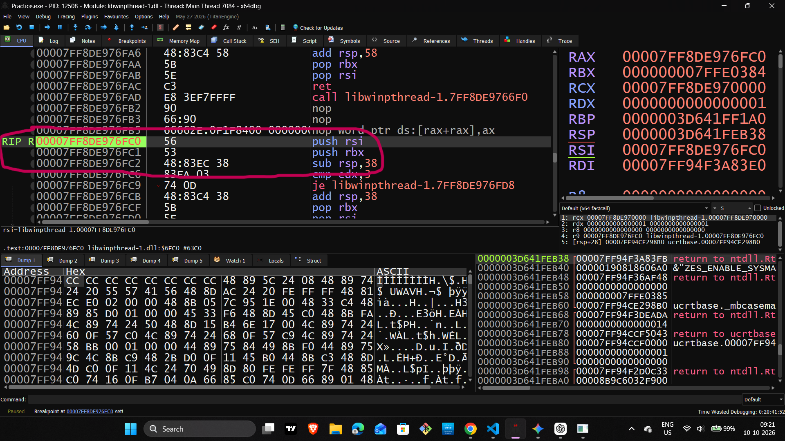
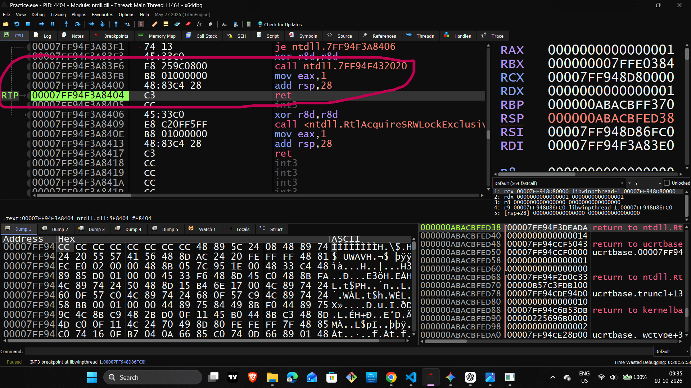
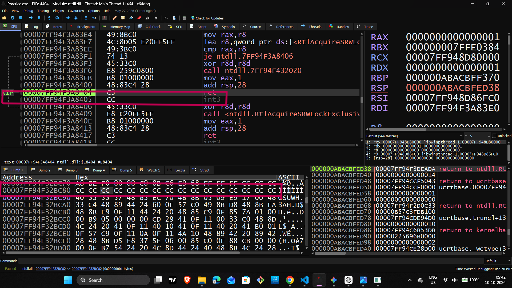
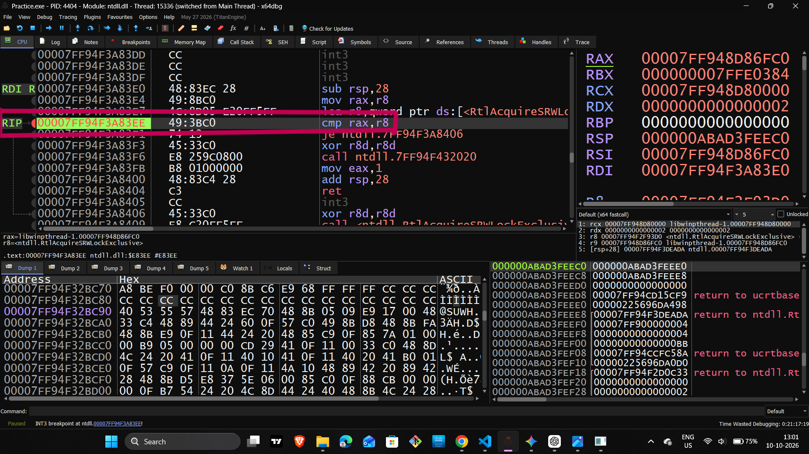
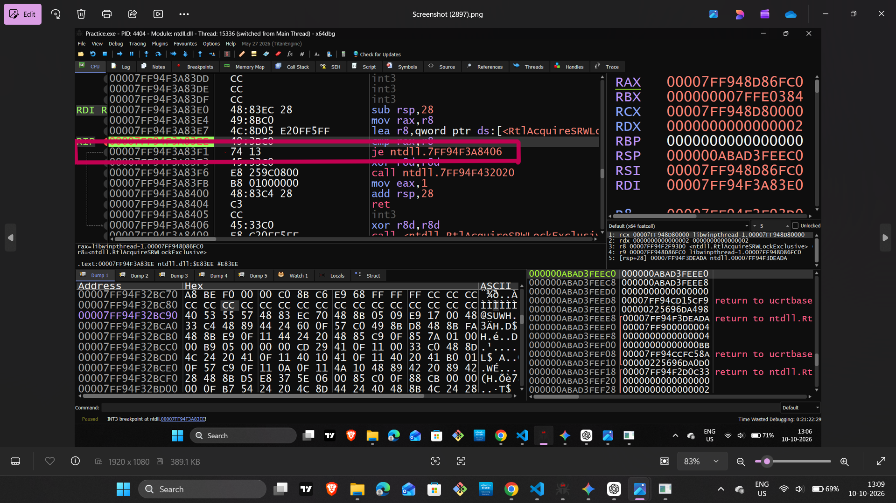

# Day 07 — x64 Assembly Analysis & Debugging

## Function Calls, Stack Operations, Memory Inspection, and Control Flow

**Learning Track:** Reverse Engineering & Low-Level Engineering  
**Day:** 07  
**Architecture:** x86-64  
**Tools:** C++, x64dbg, VS Code

---

## 1. Objective

The goal of this practical was to understand how x64 assembly instructions work during program execution.

I focused on:

- Function prologues and stack allocation
- CALL, RET, and JMP instructions
- NOP and INT 3 opcodes
- CPU registers and memory inspection
- CMP instructions and CPU flags
- Conditional jumps and execution flow
- Hexadecimal values and little-endian memory

The practical involved inspecting instructions, registers, and memory in x64dbg.

---

## 2. Function Prologue and Stack Allocation

A function prologue prepares the stack space a function needs. The exact instructions depend on the compiler and its optimizations.

Example:

```asm
push rbp
mov rbp, rsp
sub rsp, 0x28
```

**What these instructions do:**

- `push rbp` saves the previous RBP value on the stack.
- `mov rbp, rsp` establishes a frame reference when this pattern is used.
- `sub rsp, 0x28` moves the stack pointer down by 40 bytes, reserving stack space.

**Important:** `0x28` is hexadecimal for 40 decimal. The reserved space may include local storage, alignment, or other required stack space; it is not necessarily all used by local variables.

### LEA and MOV

```asm
mov rax, r8
lea r8, [address]
```

- `MOV` copies a value from one location to another.
- `LEA` calculates an effective address and places that address in a register.



---

## 3. Function Calls and Returns: CALL and RET

### CALL

```asm
call target_function
```

A near `CALL` saves the return address on the stack and transfers execution to the target.

### RET

```asm
ret
```

`RET` obtains the return address from the stack and transfers execution back to the caller.

### JMP

```asm
jmp target
```

`JMP` transfers execution to the target without automatically saving a new return address.

| Instruction | Purpose |
|---|---|
| `CALL` | Calls a target and saves a return address |
| `RET` | Returns using the saved address |
| `JMP` | Transfers execution directly to a target |



---

## 4. NOP and INT 3

### NOP — No Operation

```asm
nop
```

- The common one-byte encoding is `90`.
- It performs no meaningful general-purpose data operation.
- It may be used for padding or instruction alignment.

### INT 3 — Breakpoint Exception

```asm
int3
```

- The one-byte encoding is `CC`.
- It generates a breakpoint exception.
- Debuggers can use this instruction to implement software breakpoints.

**Important:** Seeing `CC` bytes in a memory dump does not, by itself, prove that a debugger breakpoint is active there. Check the instruction location and debugger state.



---

## 5. Registers and Memory Inspection

Registers hold values that instructions use. Memory addresses identify locations where data can be stored.

Example:

```asm
mov dword ptr [rbp-0x4], eax
```

Assume:

```text
RBP = 0x1000
EAX = 14 decimal = 0x0E
```

The effective address is:

```text
0x1000 - 0x4 = 0x0FFC
```

The instruction writes a 32-bit value from EAX to memory at address `0x0FFC`.

### Common Data Sizes

| Name | Size |
|---|---:|
| BYTE | 8 bits (1 byte) |
| WORD | 16 bits (2 bytes) |
| DWORD | 32 bits (4 bytes) |
| QWORD | 64 bits (8 bytes) |

### Little-Endian Representation

The 32-bit value 14 is `0x0000000E`. On x86-64, its bytes are stored least-significant first:

```text
0E 00 00 00
```

When reading a dump, check the operand size and byte order before interpreting the data.


---

## 6. Hexadecimal Basics

Hexadecimal is a base-16 number system. Its digits are:

```text
0 1 2 3 4 5 6 7 8 9 A B C D E F
```

Examples:

| Decimal | Hexadecimal |
|---:|---:|
| 10 | `0xA` |
| 14 | `0xE` |
| 15 | `0xF` |
| 16 | `0x10` |
| 40 | `0x28` |

For example, hexadecimal `0x10` represents decimal 16, not decimal 10.

---

## 7. CMP and CPU Flags

The `CMP` instruction compares two operands by performing a subtraction for flag-setting purposes. It updates CPU flags without saving the subtraction result to the destination operand.

Example:

```asm
cmp rax, r8
je equal_target
```

Conceptually, the comparison evaluates:

```text
RAX - R8
```

Important flags include:

- **ZF — Zero Flag:** Set when the comparison result is zero.
- **CF — Carry Flag:** Used in unsigned arithmetic and comparisons.
- **SF — Sign Flag:** Reflects the most significant bit of the result.
- **OF — Overflow Flag:** Indicates signed arithmetic overflow.

If RAX and R8 contain equal values, `CMP` sets ZF to 1. If they differ, ZF is 0.



---

## 8. Conditional and Unconditional Jumps

### Unconditional Jump

```asm
jmp target
```

Execution transfers directly to the target.

### Equality Jumps

```asm
je equal_target
jne not_equal_target
```

- `JE` jumps when ZF = 1.
- `JNE` jumps when ZF = 0.

These instructions commonly follow a comparison, but the flags may also have been set by another instruction.

### Signed Comparisons

| Instruction | Meaning |
|---|---|
| `JG` | Signed greater than |
| `JGE` | Signed greater than or equal |
| `JL` | Signed less than |
| `JLE` | Signed less than or equal |

### Unsigned Comparisons

| Instruction | Meaning |
|---|---|
| `JA` | Unsigned above |
| `JAE` | Unsigned above or equal |
| `JB` | Unsigned below |
| `JBE` | Unsigned below or equal |

Signed and unsigned jumps interpret the same bit patterns differently. Choose the jump according to the intended comparison.

**Screenshot:** `Screenshots/06_conditional_jump.png`

---

## 9. Practical Debugging Workflow

When analyzing an instruction in x64dbg:

1. Locate the instruction in the CPU view.
2. Read its operands carefully.
3. Inspect the relevant registers.
4. Calculate the effective memory address if needed.
5. Inspect the memory in the Dump window.
6. Check CPU flags after instructions that modify them.
7. Step through execution and observe the actual branch.
8. Compare the observed behavior with the expected program logic.

A screenshot is evidence of the state visible at that moment. Do not claim that a jump was taken unless the execution state confirms it.

---

## 10. Key Takeaways

- Function prologues and stack allocation depend on compiler-generated code.
- `CALL`, `RET`, and `JMP` have different control-flow behavior.
- `NOP` commonly uses opcode `90`; `INT 3` uses `CC`.
- Memory values must be interpreted using the correct size and byte order.
- `CMP` updates flags but does not store its subtraction result.
- `JE` and `JNE` use the Zero Flag.
- Signed and unsigned comparisons require different conditional jumps.
- Debugging is about verifying register values, memory, flags, and execution—not just reading instructions.

---

## 11. Practical Status

**Day 07 — Assembly Analysis & Debugging Review**

This session consolidated key concepts in function execution, stack memory, instruction encodings, CPU flags, and conditional control flow using x64dbg.

**Next step:** Continue with small C++ programs and trace their generated assembly to distinguish application code from Windows system-library code.